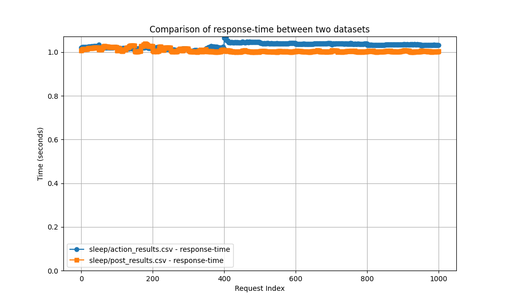
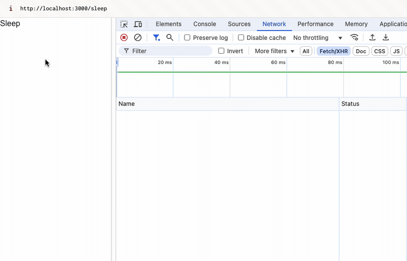

# Next.js performance benchmarks

This is a playground for testing the performance of Next.js APIs and Server Functions.

## Background

Server functions (formerly known as Server Actions) are a new feature in React that allows you to write async functions that client components can trigger, but are executed on the server.
They have been criticized for being slow as they are sequentially executed.

In this repo I want to dive deeper into how these server functions perform, and if they can be made faster through some clever hacks.

## Findings

### Server Functions vs API Routes

Server functions in and of themselves are not necessarily slower than API routes.
After benchmarking a simple API route and a server function the results were pretty similar.

In the above figure you can see the results of running 1000 requests towards an API route and a server function.
The implementation of these are identical, where both just instantly return `"OK"`.

Comparing the results of the server function and the API route we can see that they behave quite similarly.
The build up that can be seen in both graphs is due to a build up of requests that Next.js is not able to finish processing quick enough before more requests come in. We could eliminate this by staggering the requests, but that was not the focus of this benchmark.

After all requests have been sent we can see both server functions and the API route go back to a similar average response time.

Interestingly the build up phase is shorter for the server function.
I have not looked into this in detail, but might be worth looking into at a later date.

#### More complex implementations

I also looked into how server functions and API routes perform when the server function is doing some more real-world like tasks.
To simulate this I made both the server function and the API route sleep for one seconds, to simulate how they would perform in a scenario where they would for instance fetch some data from a database.

My hypothesis was that the server function would perform worse than the API route in this scenario, due to the sequential execution.

As seen in the above figure the server function performs similarly to the API route in this scenario as well, where both pretty much instantly respond after sleeping for one second.
If there was any sequential execution happening it would have been visible in the graph, but we can clearly see that this is not the case.

The story is different however when we try to make requests through the user interface.

Here we can see the sequential execution in action.
It would therefore seem that the sequential execution is only a "problem" on the client.

In the above example we only dispatched the same action several times, but even when we are dispatching different functions the server functions will execute sequentially.
An example of this can be found in the [sleep-3 example](./app/sleep-3/action-dispatcher.tsx), where we dispatch five different server functions and are still forced to wait for the sequential execution.

## Composed functions

On the client, server functions are executed parallely.
So if you don't need the safety of the sequential execution of server functions you can create a new server function that composes the server functions you want to execute.
An example of this can be found in the [composed-actions example](./app/composed-actions/action-dispatcher.tsx).
