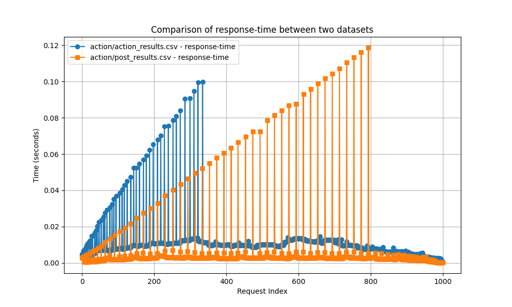

# Next.js performance benchmarks

This is a playground for testing the performance of Next.js APIs and Server Functions.

## Background

Server functions (formerly known as Server Actions) are a new feature in React that allows you to write async functions that client components can trigger, but are executed on the server.
They have been criticized for being slow as they are sequentially executed.

In this repo I want to dive deeper into how these server functions perform, and if they can be made faster through some clever hacks.

## Findings

### Server Functions vs API Routes

Server functions in and of themselves are not necessarily slower than API routes.
After benchmarking a simple API route and a server function the results were pretty similar.

In the above figure you can see the results of running 1000 requests towards an API route and a server function.
The implementation of these are identical, where both just instantly return `"OK"`.

Comparing the results of the server function and the API route we can see that they behave quite similarly.
The build up that can be seen in both graphs is due to a build up of requests that Next.js is not able to finish processing quick enough before more requests come in. We could eliminate this by staggering the requests, but that was not the focus of this benchmark.
After all requests have been sent we can see both server functions and the API route go back to a similar average response time.

Interestingly the build up phase is shorter for the server function.
I have not looked into this in detail, but might be worth looking into at a later date.
